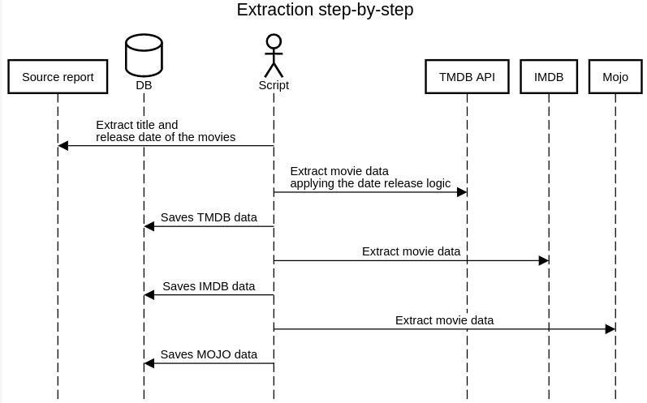

# Netflix top 10 movies data collection

This project was conceived as a pipeline to extract data from a list of movies, and this data will be/was used (probably 'was' depending on when you read it) to generate a report to be analyzed.

The goal of the analysis is to measure if the result of a movie in cinema has any correlation with its result on streaming, and as it's a bit hard to find this kind of data about streaming, we based our research on the [Netflix top 10 data](https://www.netflix.com/tudum/top10/) (call it **top 10**) we found on this report, and we used two engagement reports from [december of 2023](https://about.netflix.com/en/news/what-we-watched-a-netflix-engagement-report) (call it **H1**) and [may of 2024](https://about.netflix.com/en/news/what-we-watched-the-second-half-of-2023) (call it **H2**) to cross-check the release dates we could. The release dates are really important for the process, since with it we can have a very strong direction on knowing if the movie we are getting the data is the correct one, since in the market we can find several movies with the exact same name, then, the release date serves as a complementary information in this research.

With these three files in hand, we generated a new one containing the name of the movie (from the top 10 file), and, if the movie was present on H1 or H2 and had a release date there, the release date, generating a new file (call it **source report**) something like this:

```markdown
| show_title      | date_release         |
|-----------------|----------------------|
| Kung fu panda 3 | 2016-03-17 00:00:00  |
| Dune 2          |                      |
| Space Jam 2     | 2021-06-16 00:00:00  |
```

## Sources

To collect the data we used three different sources, to get different data from each one, detailed below.

#### TMDB API

The [TMDB API](https://developer.themoviedb.org/reference/intro/getting-started) is the starting point of our collection, and the one we use to find the movies, since dealing directly with JSON is way easier and faster to work, and also because they have a release-dates endpoint with very rich informations for us.

Another very important thing about TMDB is that they correlate the movies with the id of IMDB, so we have the guarantee that when we go to IMDB to extract more data, we are collecting the data from the same movie, instead of searching by name and facing the risk of getting another one.

###### Fields extracted:

- tmdb_id
- report_title
- tmdb_title
- tmdb_budget
- release_date_streaming
- release_date_streaming_country
- all_countries_streaming
- release_date_theater
- release_date_theater_country
- all_countries_on_theater
- revenue
- imdb_id

###### Endpoints used:

- [search-movie](https://developer.themoviedb.org/reference/search-movie)
- [movie-details](https://developer.themoviedb.org/reference/movie-details)
- [movie-release-dates](https://developer.themoviedb.org/reference/movie-release-dates)

#### IMDB

The [IMDB](https://www.imdb.com/) is one of the most known websites worldwide for movies data, and we also used it to collect a few important metrics, but especially the IMDB rating which is a very strong information to account when measuring the success of a movie. Since the only way to get this information is through webscrapping, we limit ourselves to just a few fields.

###### Fields extracted:

- imdb_title
- rating
- imdb_budget
- gross_worldwide
- gross_us_canada
- openning_week_us_canada

#### Mojo Box Office

[Mojo Box Office](https://www.boxofficemojo.com/) is the last source of data we used, and we also had to webscrap it to extract the data. We had some box office information from IMDB, but the idea here is to compose more data, in the case of IMDB not having it. Also we extracted a few more data that was way easier to get than on IMDB like	MPAA and the genres of the movie.

Another important information is that Mojo uses the same ID for the movies than IMDB, so here we also have the guarantee that the movie we collected the data on TMDB API is the same we are collecting here.

###### Fields extracted:

- mojo_performance_domestic
- mojo_performance_international
- mojo_performance_worldwide
- mpaa
- genres

## Extraction process

#### Database

To avoid running a single script through all the report, a database instance was used to store the data from each source (PostgreSQL simply for convenience), so we could have smaller scripts running to collect specific data for each step of the process, and, if something breaks in the middle of it, we didn't have to run everything from the beginning. To accomplish that, one table was created for each source, namely `tmdb_movie`, `imdb_movie` and `mojo_movie`, each of them containing the data specific for that source, and also one script was created to populate each source, `tmdb_filler.py`, `imdb_filler.py` and `mojo_filler.py`.

#### TMDB API phase

As mentioned above, the first source of data is the TMDB API, since we could cross-check the release dates present on it with the release date present in the source report, so, the steps in the script to collect data from it were:

1. Get the title list from the source report.
2. One by one, search the title and store the IDs of all of them that had a similar name with the one in the report (since we could have different movies with the same name, we had to validate which one we want).
3. If no movies were found with the exact same name of the one in the report, we save the first result (since it should be the closest name)
4. If just one movie is found for the title, we have nothing to validate, so we just save it.
5. If more than one movie is found with the same name, we check the release dates:
   1. If there's no release date in the TMDB API, we save the first one, as there's no reference to compare with.
   2. If there's release date on both source report and the TMDB API, we save the one in the TMDB API with the closest date from the source report (since there are different release dates for different sources around the world, there could be a small difference in days, this is the why we don't look for the exact same date).
   3. If we have the release date in the TMDB API, but not in the source report, we choose the movie we the release date closer to the middle of 2023 (the year of the report)

#### IMDB phase

Since we already have the IMDB ID saved on the database, we can just run through it sending the requests and extracting the data.

#### Mojo phase

Same as the IMDB collection, since it uses the IMDB ID and it's already in the database, there's no logic here other than select the IDs in the database and collect the data.

#### Step by step



## How to run it

1. First of all, it's needed to have a TMDB API Api Key, that can be generated in [this link](https://developer.themoviedb.org/reference/intro/getting-started), and needs to be stored in an environment variable called `TMDB_API_KEY`.
2. Run the database container through the `docker-compose.yaml` file.
3. Connect to the database and run (manually, sorry for that) the SQL script present on the `db.sql` file.
4. Before running the scripts, it's recommended to use an environment variable, I used `venv` when coding this project.
   1. $ `python3 -m venv venv`
   2. `$ source /venv/bin/activate`
5. Install the dependencies on the `requirements.txt` file
   1. `pip install -r requirements.txt`

6. Run the `fillers/tmdb_filler.py` script and wait for it to finish.

7. Run the `fillers/imdb_filler.py` script and wait for it to finish, you can run many of them simultaneously to be faster.

8. Run the `fillers/mojo_filler.py` script and wait for it to finish, you can also run many of them simultaneously to be faster.

9. With the data already in the database, run the `generate_report.py` script to generate the report.

## Improvement opportunities

- To have a faster collection, for the IMDB and the Mojo phases, since we already had the needed IDs on the database, we implemented a logic for the script to get the IDs one by one from the database, so we could run N scripts simultaneously and faster the process, but we could use something like a mensagery tool to be able to run the 3 phases at the same time, so when we collect the data from TMDB, it publishes a message and the IMDB and Mojo scripts consumes it to be even faster.
- The database script is in a separated file, since we didn't have much time to make this process fancier, but we could use a migration tool instead of having to run is manually when we create the database.
